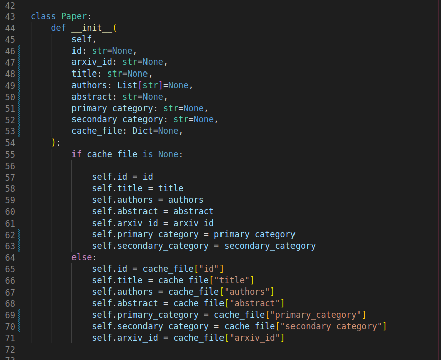

# Paper Explorer

The repository contains code for final project of course SI 507 offered during FA 2022 at the University of Michigan, Ann Arbor.

<figure>

<figcaption align = "center"><b>Interface for the application</b></figcaption>
</figure>

## Environment Setup

All the required python packages needed for the project are listed inside `requirements.txt`. You can either use the command `pip install -r requirements.txt`, or manually install them in your python environment using the following lines:

```
pip install pandas
pip install Flask==2.2.2
pip install requests
```

You will require a semantic scholar API key for this application. Please use this form(https://www.semanticscholar.org/product/api#Partner-Form) to request the API key anf insert it inside `data/secret_key.py` file.

Optionally, you can also download some of the cached papers here.

Once the key is its place run the following commands:

```
cd src
python app.py
```

This should switch the Flask server on at `http://127.0.0.1:5000`.

To read about the Data structure used in the backend, please read this.

# Data Structure

## Overview
<p style="text-align: justify;">
The overall data structure used for the application is predominantly inspired from the user's intended use of the application. As mentioned in [UserInrerface.md](./UserInterface.md), we can explore the papers continually in a hierarchial fashion. I have divided the data into a graph-type data structure. Ideally, this graph can have countably infinite nodes. Intuitively, we know that each paper has a list of authors, references, and citations. Each of the authors further has papers and a list of the other authors they worked with. Additionally, each of the papers in citations and references has its authors. This chain of paper-author-paper… is essentially countably infinite, and is the key motivation behind using the graph structure. Using the graph structure enables the user to seamlessly explore any paper-author, paper-paper, or author-paper edges. Based on this, the graph has three types of nodes which are predominantly derived from the way in which the user experience happens for the project(as mentioned briefly above). There are predominantly 3 nodes for the graph. Each of the nodes has been implemented using Python class. The figure shows the overview of the Grpah structure
</p>
<figure>

<figcaption align = "center">Figure showing the graph data structure used</figcaption>
</figure>

## Arxiv Paper Class:

The main purpose of this class is to store the results of Arxiv papers. The results from Arxiv API are stored as the attributes of this class. Note that I have a general `Paper` class that is then inherited by both `ArxivPaper` and `SemSchPaper`. To make a graph edge between Arxiv class and the Semantic Scholar Paper class as mentioned in Section 2.1, we use the Arxiv paper ID as a query to find the semantic scholar paper ID. While in the cache, we store the results for this class as a separate JSON and only form the graph edges once the data is in the memory. The reason behind not storing the whole graph at once is that the sheer size of this file becomes very big. The class attributes here are :

- `id`: Semantic Scholar paper ID of the Arxiv paper
- `arxiv_id`: Arxiv ID of the paper
- `title`: Title of the paper
- `authors`: Authors of the paper
- `abstract`: Abstract of the paper
- `primary_category`: Primary Category of the paper as shown by Arxiv API. This can be either `cs`, `eess`, `math`, or `econ`and is derived from [here](https://arxiv.org/category_taxonomy)
- secondary_category: This is the secondary category of the paper and gives more specialized category type. This is derived from [here](https://arxiv.org/category_taxonomy)
- cache_file: A cache dictionary containing class attributes 

The screenshot for the `Paper` class definition is below:
<figure>

<figcaption align = "center">Figure showing the Paper class</figcaption>
</figure>

The screenshot for `ArxivPaper` is mentioned below:

<figure>

<figcaption align = "center">Figure showing the ArxivPaper class</figcaption>
</figure>


## Semantic Scholar Paper class:

This class is the second on the hierarchy of the graph after the Arxiv Paper class. As mentioned in Section 2.2, each Arxiv node has an Arxiv ID that is used to initialize the Paper class. The main purpose of this class is to represent information about a paper fetched from semantic scholar API. Among the attributes of this class, we have a list of authors of the paper, a list of paper references, and a list of citations of the paper. For each list, I just store an index that is then used to get the actual paper or author from the in-memory dictionary during run time. 
The class attributes here are :

- `id`: Semantic Scholar paper ID of the Arxiv paper
- `arxiv_id`: Arxiv ID of the paper
- `title`: Title of the paper
- `authors`: Authors of the paper
- `abstract`: Abstract of the paper
- `primary_category`: Primary Category of the paper as shown by Arxiv API. This can be either `cs`, `eess`, `math`, or `econ`and is derived from [here](https://arxiv.org/category_taxonomy)
- `secondary_category`: This is the secondary category of the paper and gives more specialized category type. This is derived from [here](https://arxiv.org/category_taxonomy)
- `year`: Year in which the paper was published
- `reference_count`: Number of references of the paper
- `citation_count`: Number of citations of the paper
- `influential_paper_citations`: Number of influential citations of the paper
- `is_open_access`: Is the paper open access or not
- `citations`: A list of strings representing the Paper IDs of the citations of the paper 
- `references`: A list of strings representing the Paper IDs of the references of the paper 
- `url`: URL of the Paper
- `cache_file`: A dict having cached info.

The screenshot showing `SemSchPaper` the class definition is below:
<figure>

<figcaption align = "center">Figure showing the SemSchPaper class</figcaption>
</figure>

Note that I have inherited the `Paper` class here which is also used in defining the Arxiv paper class.

## Author Class:

The main purpose of this class is to represent author information. Among the attributes of this class is the list of papers of the author and the list of authors that this author has worked with. These lists are used to form the author-author edge and author-paper edge. As mentioned in Section 2.3, the list of authors contains the Author ID which is then used to query the author information from the list of author nodes, each of which is an author class. 
The class attributes here are :

- `id`: The semantic scholar author ID
- `name`: Name of the Author
- `homepage`: Homepage of the author
- `paper_count`: Number of papers published by the author
- `citations`: Number of citaions the author has received
- `hindex`: H-index of the author
- `papers`: List of the semantic scholar paper IDs published by the authors
- `worked_with`: List of the semantic scholar Author IDs of the other authors who worked with this author
- `cache_file`:  A dict having cached info.

The screenshot for the class definition of the `Authors` class is shown below.
<figure>

<figcaption align = "center">Figure showing the Authors class</figcaption>
</figure>

## Organizing in a graph

Using the three nodes mentioned, I then use the file `src/generate_object_tree.py` to organize it into a tree structure. There are three main classes inside this Python file namely `SemSchTree`, `ArxivTree`, `AuthorTree` that are used for this ogranization. The choice of making three separate Grpahs here was based on the fact that dumping all the data in one file grows the cached file size very quickly. To mitigate that, I store each node separately and use thhe loaded JSON to traverse through the graph structure. 

### `ArxivTree` class
This class loads the tree pertaining to Arxiv papers. It has a read/write cache functions that perform the essential data read/writes every time we request a new set of papers from the Arxiv API. The main controlling function inside this class is `gather_data` which takes the user input  `paper_title`, `author` `abstract`, `use_cache`, `primary_category` , and `secondary_category` and processes them accordingly. Here, the functionailties `primary_category` and `secondary_category` only access the cached data and do not request any new papers from the Arxiv API. This function returns a list of papers, `papers_data` that gets displayed on the user page. Also, this class also calls semantic scholar API to request the semantic scholar paper ID for the corresponding Arxiv Paper ID

### `SemSchTree` class
This class loads the graph pertaining to Semantic Scholar papers. It has a read/write cache functions that perform the essential data read/writes every time we request a new set of papers from the Semantic Scholar API. The main method of this class is `fetch_paper_data` that takes is the semantic scholar Paper ID(the output of `ArxivTree`) and returns all the details pertiaing to the paper. It also has methods like `update_papers` that forms `paper-paper` edge of the graph. This function essentially finds out details pertianing to the citations and references of the paper. For each `Authors` node inside this graph, we onoy store the `author_id`, `citation_count`, `h-index`, and `paper_count`. The rest of the information like other authors that worked with this author and the papers of each of the author is store inside a separate graph called `AuthorTree`. It returns all the information of the requested Paper that gets displayed on the Paper Page


### `AuthorTree` class
This class loads in all the author information for semantic scholar Authors. It has a read/write cache functions that perform the essential data read/writes every time we request a new set of papers from the Semantic Scholar API. The main method of this class is `get_author_data` which takes two inputs, `author_id` and a class object of type `SemSchTree`. This function establishes the essential link between the papers and authors and forms the `paper-author` edge of the graph. It returns all the information of the requested author that gets displayed on the Author Page


