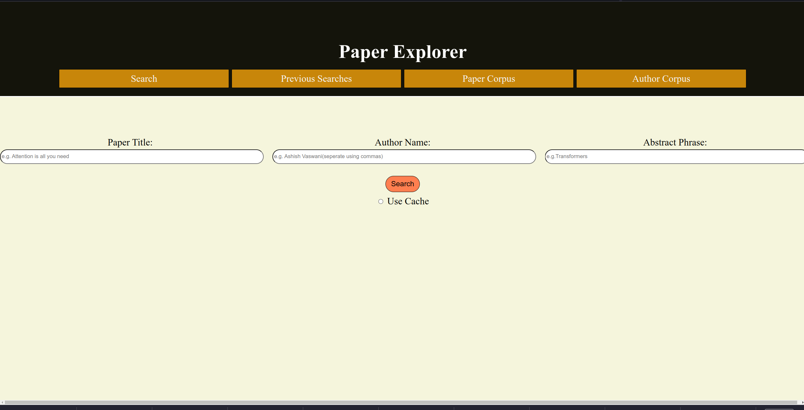
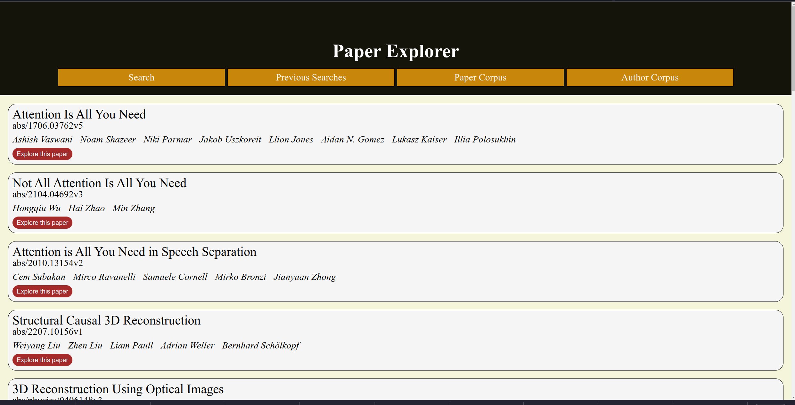
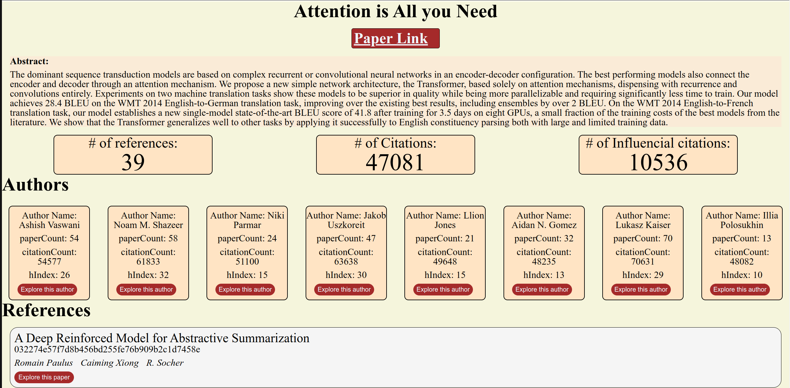
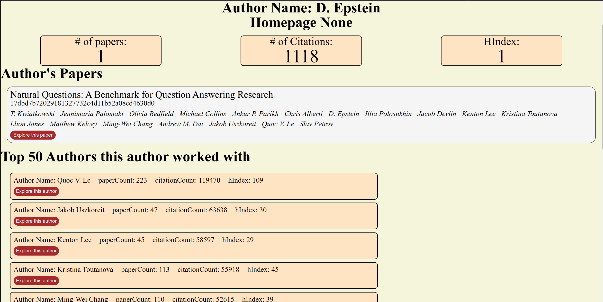

# Overview

I have used Flask as a major technology for presenting the data. The overall application UI is focussed on helping the user explore papers and authors seamlessly in hierarchial fashion. Below is the description of different user pages. 

## Landing Page

It starts with user feeding in the paper title they like, or, name of the author the user like, or, a keyword from the abstract of the paper. Along with this, the user will also check if the application should use a cache for Arxiv papers or retrieve the new set of papers. The idea behind this radio button is that Arxiv has almost hourly updates of papers and there could be a scenario in which the user does not want to see brand-new papers. Once the user hits the “Search” button, depending on their choice of caching the application will display a list of papers that are a possible match to their query. At the backend, there are two major requests that are being made when this happens. First, the app requests the Arxiv API to fetch the result of the user query and second, we query the Semantic Scholar API to fetch the Semantic Scholar Paper ID for the corresponding Arxiv ID. As we are requesting Semantic Scholar API here, there is speed lag that is visible. Below is the screenshot showing the landing page. 

<figure>

<figcaption align = "center">Landing Page</figcaption>
</figure>

## Arxiv Paper Page

This is the second page that the user sees after they click the Search button. This page consists the list of all the Arxiv Papers that are available for the user Query. Note that for some papers on Arxiv, there is no corresponding Semantic Scholar Paper ID and for those papers, I add a error message that is present in the title of the Paper Displayed. Below is a screenshot of the Arxiv paper page. 

<figure>

<figcaption align = "center">Arxiv Paper Page</figcaption>
</figure>

## Semantic Scholar Paper Page

Once the user selects a paper from the given list of Arxiv papers, they are taken to the Semantic Scholar Paper page. Here, I fetch various details about the paper from Semantic Scholar API. These results include paper title, it's authors, references, and citations. As the purpose of this interface is to give the user a freedom to explore papers and authors. Each of the author of the paper, references, and citations are in turn clickable and the user can explore them further. If the user clicks on a paper(references and citations), they are shown a similar Semantic Scholar paper page for the selected Paper. This "exploration" and ideally go an and on, as long as we are under the Semantic Scholar API requests limit. Below is the screenshot of the Semantic Scholar Paper Page. 

<figure>

<figcaption align = "center">Semantic Scholar Paper Page</figcaption>
</figure>

## Semantic Scholar Author Page

The author page is dedicated to the show all the author detials to the user. As mentioned in the previous section, the user can click on any of the authors of the paper and can explore them further. This page shows various results pertaining to the author, like their H-Index, Citation Count, Paper Count, and the Influential Citation count of the author. Further, the page also shows the other authors the author has worked with and a list of author's papers. Each of the other author and the papers can be further explored. As mentioned in the previous section, this search or exploration can go on and on,as long as we are under the Semantic Scholar API requests limit. Below is the screenshot of the Semantic Scholar Author Page.

<figure>

<figcaption align = "center">Semantic Scholar Author page</figcaption>
</figure>